# GIT and GITHUB Complete Guide

Welcome to the ultimate beginner-friendly guide to learning Git and GitHub! This repository serves as a step-by-step documentation covering everything from basic local setup to branch management and remote hosting.

---

## 👤 Author & Contribution

- **Author:** [Mr. Nexora](https://github.com/mr-nexora) 🚀
- **Project Purpose:** This repository was created as a personal learning milestone while mastering version control systems for Full-Stack Development and DevSecOps workflows.

### 💖 Special Thanks & Acknowledgments

This guide was built and structured while learning from an amazing YouTube tutorial playlist. Huge thanks to the creator for the clear explanations!

- **Tutorial Source:** [SL CodingGura YouTube Channel]
- **Watch Playlist:** [Click Here to Watch the Playlist](👉 https://youtube.com/playlist?list=PLCuKf5HB0VfkcuAIcZQQR8e9_7-DhfADo&si=QS8xOr7M8BsYARgn)

---

## 📌 Quick Overview: What is inside?

This repository is structured as a complete roadmap for absolute beginners. Inside, you will find:

1.  **Git Installation & Global Configurations:** Setting up your environment.
2.  **Local Repository Operations:** Initializing, tracking status, and staging files.
3.  **The Art of Commits:** Saving code checkpoints with clean log histories.
4.  **Branching & Merging:** Safe environment management to experiment with new features and fixing bugs without breaking the main production code.
5.  **GitHub Integration:** Hosting projects on the cloud and pushing updates.
6.  **Ultimate Cheat Sheet:** A quick reference table for daily commands.

---

## 1. Introduction and Setup

### Install Git

Download and install Git for Windows from the official website:
[Download Git for Windows](https://git-scm.com/install/windows)

### How to Configure Username and Email globally

Before making any commits, configure your global identity. This links your name and email to all your repositories.

````bash
# Set your global username
git config --global user.name "John Doe"

# Set your global email
git config --global user.email "john@gmail.com"

---

# How to upload our project in GIT | Steps

## Open git

- Go the project folder, and **write click** and select **show more options** and open **GIT bash**

### Note:

- Create New folder

```git bash
    mkdir gitTest // gitTest is a folder name
````

- Go the inside of folder

```git bash
    cd ./gitTest
```

- Open VS code

```git bash
    code .
```

---

## How to git Initialize our project

```git bash
    git init
```


## How to view our git repository in git bash

```git bash
    ls -la
```


## How to view our git repository status

```git bash
    git status
```


- We can look Untracked files, These are not add inside a repo...

## How to add our files in repository

```git bash
    git add index.html
```


## How to add all files in one Command

```git bash
    git add --all
```


## How to add git commit

```git bash
     git commit -m "I created my first project and I added some files to it"
```


## How to view git commit

```git bash
    git log
```


3. **GIT Branch and Branch Merge**

## How to create git branch

```git bash
    git branch test // test is the branch name
```

- If we work more code files, then we have some problems(errors) this codes... we can't fix this error in main branch because it is risk...
- But we can create another branch, it is almost same our main brancher... Now we can fix our errors in this branch and we trust the final output we can edit our main branch

## How to see created branches

```git bash
    git branch
```


## How to checkout our branch

```git bash
    git checkout test
```


---

- Now I edit this git.md file in test branch
- Now I commit this Changes
  
  

- Now we go our master branch and look;

```git bash
    git checkout master
```


## How to create branch and checkout this branch one time ( Emergency branch creating)

```git bash
    git checkout -b test1 // test1 is new branch name
```


---

- Look git branch
  

---

## How to delete branch

```git bash
    git branch -d test1
```


---

- Look git branch
  

---

# How to add our test branch works from master branch ( Git branch merge)

- Go the master branch

```git bash
    git checkout master
```


 4. **GutHub Intro and Setup**

- **Create github account**

## How to create repo in github

1. Go repository tab
2. click **new button**
3. Fill details and click **create repository button**
   

## How to upload our project in this repo

- Github give three commands
  
- You add this commands in your git bash termnal
  
- After load termonal and refreash your browse


5. **Push and Pull with GitHub**

## How to use **Pull Command**

- First I edit my index.html file with using github code editor (I removed all comments)
- Second I check git bash

```git bash
    git status
```

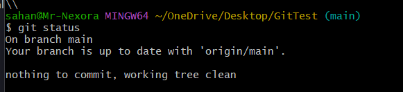

- The **origin/main** is a our project branch for uploaded github

- Now we want to get github edited data in our git, Then we use **git pull command**

```git bash
    git pull origin
```

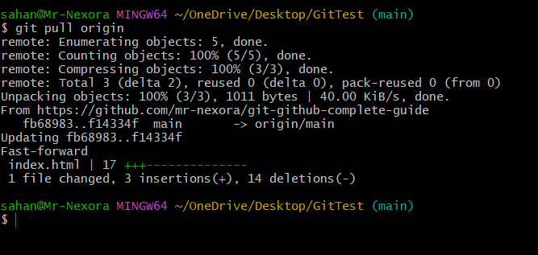

## Note:

- If we think have other branch, it name is 'test', Now this command change this type;

```git bash
    git pull origin test
```

## How to use **Push Command**

- First I edit my index.html file with using github code editor (I add all comments)
- Second I check git bash

```git bash
    git status
```

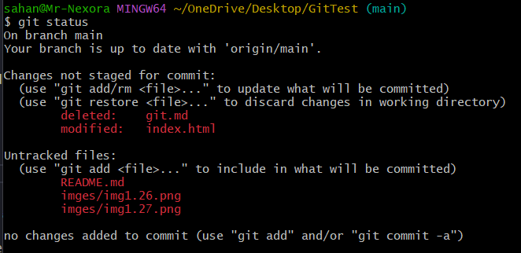
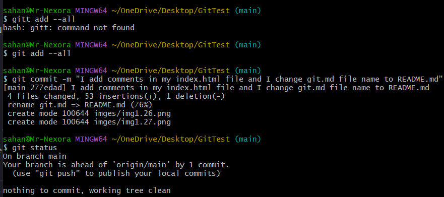

- The **origin/main** is a our project branch for uploaded github

- Now we want to get github edited data in our git, Then we use **git pull command**

```git bash
    git push origin
```

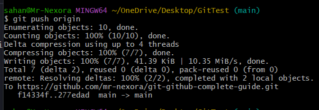

## Note:

- If we think have other branch, it name is 'test', Now this command change this type;

```git bash
    git push origin test
```

---

## How to create git brancher

- Go github repo and click **Main button**
  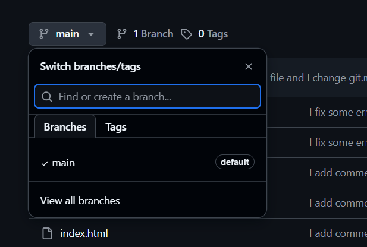

- Add branch name and click **create branch button**
  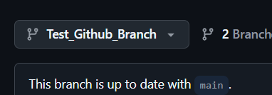

## How to add github project git branch from our local git repo

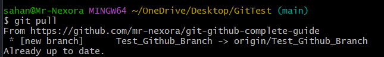

```git bash
    git pull
```

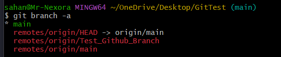

- Show the Git branch

```git bash
    git branch -a
```


- Now go to the git branch

```git bash
    git checkout Test_Github_Branch
```

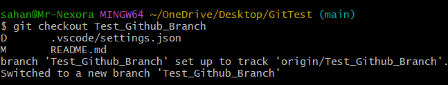

- Now check branch

```git bash
    git branch
```

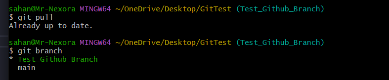
