# GIT and GITHUB

1. **Introduction and Setup**

- Install git
  [Download](https://git-scm.com/install/windows)

2. **GIT Repository and Commit**

## How to add Username and Email in Git

```git bash
    // How to add username
    git config global usernuser.name "John"
```

```git bash
    // How to add email
    git config global usernuser.email "John@gmail.com"
```

- This method add all folders and files this username and email

---

# How to upload our project in GIT | Steps

## Open git

- Go the project folder, and **write click** and select **show more options** and open **GIT bash**

### Note:

- Creatr New folder

```git bash
    mkdir gitTest // gitTest is a folder name
```

- Go the inside of folder

```git bash
    cd ./gitTest
```

- Open VS code

```git bash
    code .
```

---

## How to git inisialize our project

```git bash
    git init
```

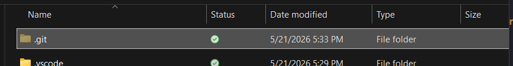
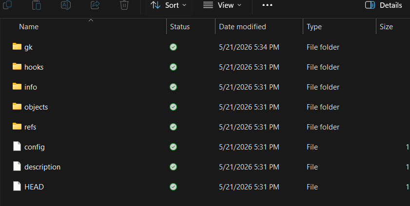

## How to view our git repository in git bash

```git bash
    ls -la
```

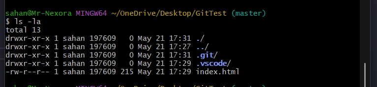

## How to view our git repository status

```git bash
    git status
```

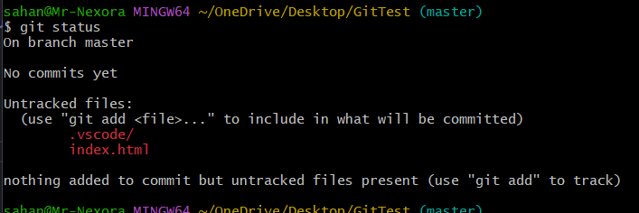
- We  can look untrackrd files, These are not add inside a repo...

## How to add our files in repository

```git bash
    git add index.html
```

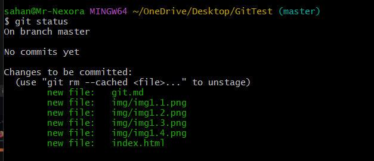

## How to add all files in one commend

```git bash
    git add --all
```

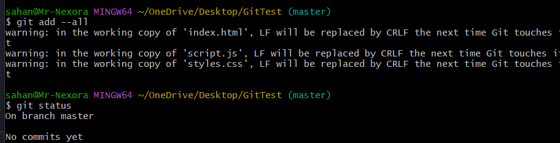
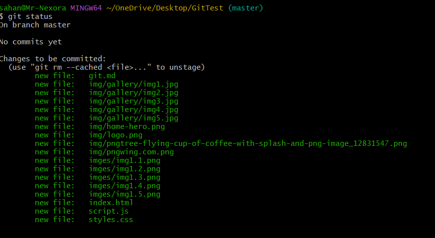

## How to add git commit

```git bash
     git commit -m "I created my first project and I added some files to it"
```

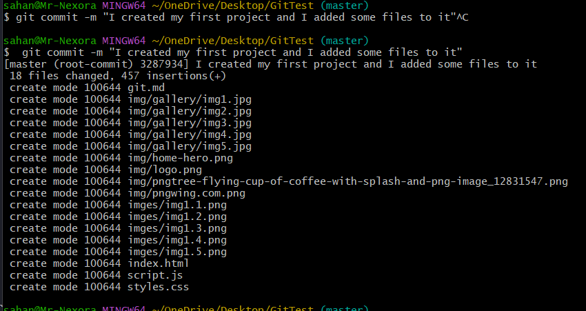

## How to view git commit

```git bash
    git log
```

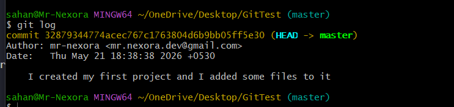

3. **GIT Branch and Branch Merge**

## How to create git branch

```git bash
    git branch test // test is the branch name
```

- If we work more code files, then we have some problems(errors) this codes... we can't fix this error in main branch because it is risk...
- But we can create another branch, it is almost same our main brancher... Now we can fix our errors in this branch and we trust the final output we can edit our main branch

## How to see created branches

```git bash
    git branch
```


## How to checkout our branch

```git bash
    git checkout test
```

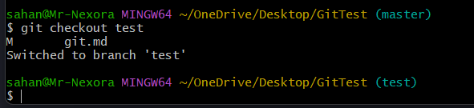

---

- Now I edit this git.md file in test branch
- Now I commit this changers
  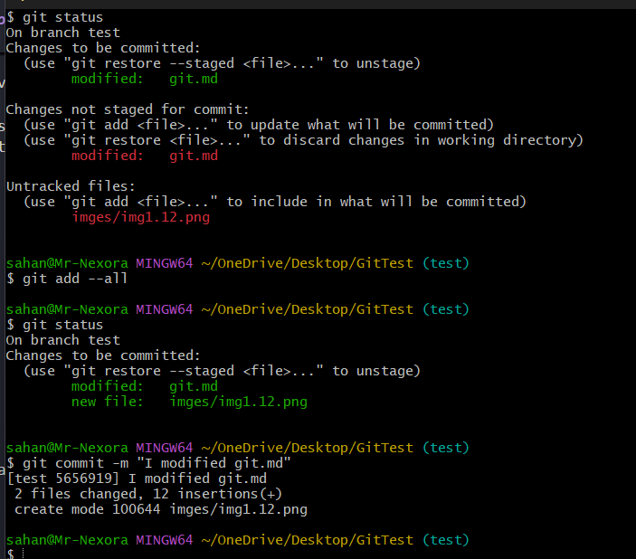
  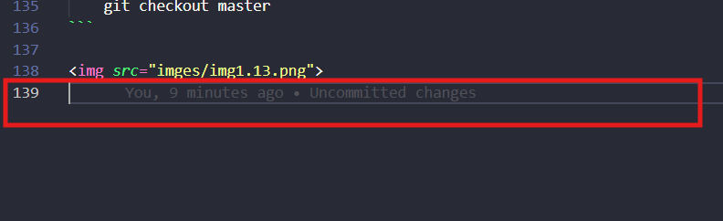

- Now we go our master branch and look;

```git bash
    git checkout master
```

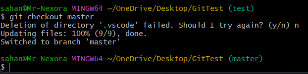
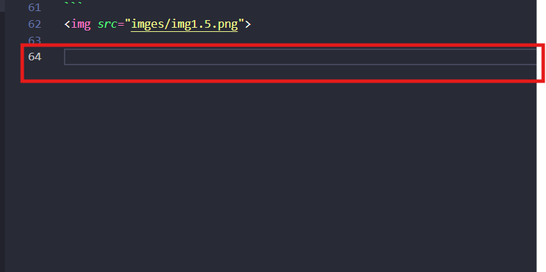

## How to create branch and checkout this branch one time ( Emergency branch creating)

```git bash
    git checkout -b test1 // test1 is new branch name
```

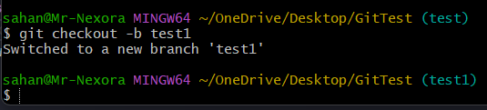

---

- Look git branch
  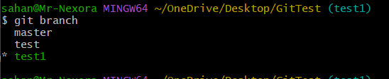

---

## How to delete branch

```git bash
    git branch -d test1
```

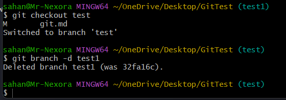

---

- Look git branch
  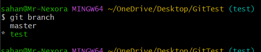

---

# How to add our test branch works from master branch ( Git branch merge)

- Go the master branch

```git bash
    git checkout master
```

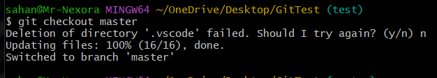
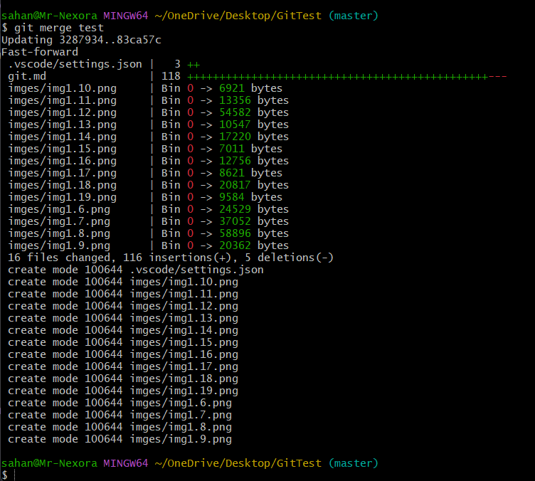

4. **GutHub Intro and Setup**

- **Create github account**

## How to create repo in github

1. Go repository tab
2. click **new button**
3. Fill details and click **create repository button**
   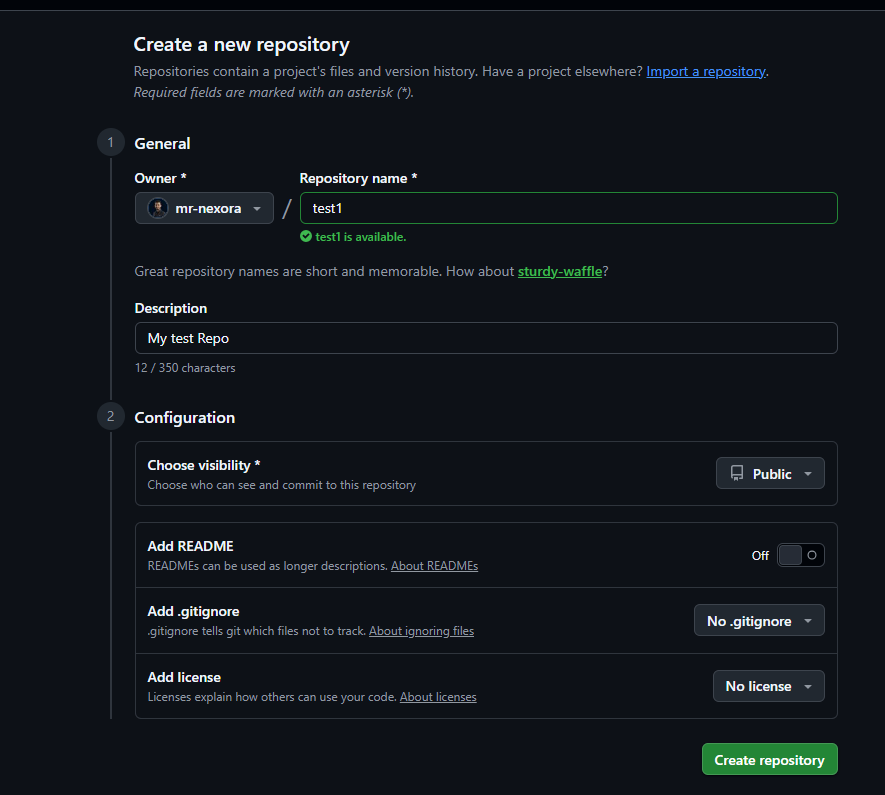

## How to upload our project in this repo

- Github give three commands
  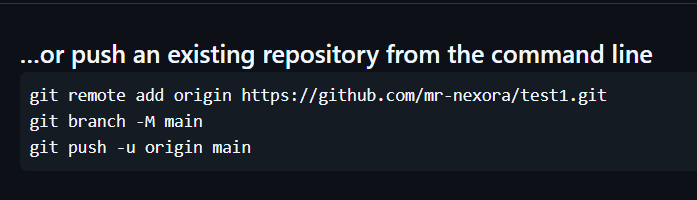
- You add this commands in your git bash termnal
  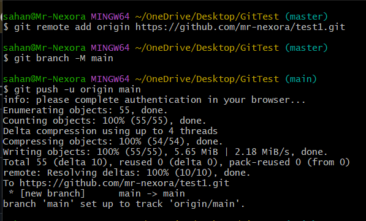
- After load termonal and refreash your browse

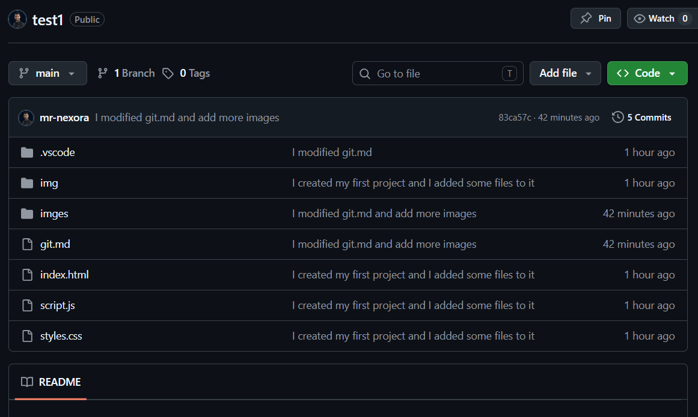

5. **Push and Pull with GitHub**
